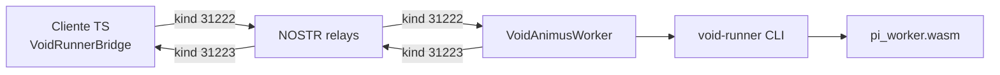

# VOID-COSMIC / ETΞRNET — VOID-VPS

Implementação do **Capítulo 14** do protocolo VOID-COSMIC: executor WASM (ANIMUS), MapReduce QEL, EcoNet, PoH, orquestração TypeScript e integração NOSTR com ET-RNET.

Especificação de referência: `doc/main.tex`, `doc/main.pdf` (47 páginas).

---

## Visão geral

| Camada | Pacote / path | Função |
|--------|----------------|--------|
| **void_core** | `void_core/` | Criptografia WASM (GhostID, QEL, PQC, PoW/VDF, Bulletproofs) |
| **void_runner** | `void_runner/` | Executor nativo (wasmtime), GhostDocker, MapReduce, PoH |
| **pi_worker** | `workers/pi_worker/` | Worker WASM de exemplo (`calculate_pi`, Leibniz) |
| **eternet_ts** | `eternet_ts/` | API TypeScript unificada + VOID-VPS + NOSTR |



---

## Pré-requisitos

- **Rust** stable + target `wasm32-unknown-unknown`
- **wasm-pack** (`~/.cargo/bin`)
- **Node.js** 20+ (testado em 22/26)
- **npm** no diretório `eternet_ts/`

```fish
# fish — paths típicos
fish_add_path ~/.cargo/bin
fish_add_path ~/.rustup/toolchains/stable-x86_64-unknown-linux-gnu/bin
fish_add_path ~/Documentos/VOID-COSMIC_VPS/target/release
```

---

## Build completo

Na raiz do repositório:

```bash
bash scripts/build.sh
```

Isso gera:

| Artefato | Caminho |
|----------|---------|
| Worker π | `artifacts/pi_worker.wasm` |
| Executor | `target/release/void-runner` |
| WASM + TS | `eternet_ts/dist/` (inclui `dist/wasm/`) |

Build só TypeScript (após Rust/WASM já compilados):

```bash
cd eternet_ts && npm install && npm run build
```

O script `npm run build` em `eternet_ts`:

1. `tsc` → `dist/`
2. Copia `src/wasm/*` → `dist/wasm/`
3. `fix-dist-esm.mjs` — adiciona `.js` nos imports relativos (Node ESM)

---

## Exemplos rápidos

Scripts na **raiz** (delegam para `eternet_ts/`) ou dentro de `eternet_ts/`:

| Comando | Descrição |
|---------|-----------|
| `npm run example:pi` | GhostID + π local via `void-runner` |
| `npm run example:mapreduce` | π com MapReduce (4 shards, env `VOID_SHARDS`) |
| `npm run example:animus` | Nó ANIMUS — escuta tarefas no NOSTR |
| `npm run example:nostr` | Cliente remoto (`localRunner: false`) |

### π local (um processo)

```bash
cd VOID-COSMIC_VPS
npm run build
npm run example:pi
```

Saída esperada: `GhostID: hydra_◆_…` e `π × 10⁶: { result: … }`.

### MapReduce

```bash
VOID_SHARDS=8 npm run example:mapreduce
```

### NOSTR — dois terminais

Use **dois terminais separados** (não corra os dois no mesmo).

**Terminal 1** — worker (deixar aberto até ver `Pronto`):

```bash
npm run example:animus
```

**Terminal 2** — cliente (só depois do worker estar `Pronto`):

```bash
npm run example:nostr
```

Variáveis úteis:

| Variável | Default | Uso |
|----------|---------|-----|
| `VOID_SHARDS` | `1` (nostr) / `4` (mapreduce) | Shards MapReduce |
| `VOID_TIMEOUT_MS` | `120000` | Timeout à espera do ANIMUS |
| `VOID_RELAY_WARMUP_MS` | `5000` | Espera relays antes de publicar |

Relays usados nos exemplos (sem paywall de escrita): `damus.io`, `nos.lol`, `nostr.band` — ver `eternet_ts/src/transport/voidRelays.ts`.

---

## CLI `void-runner`

```bash
void-runner run artifacts/pi_worker.wasm --func calculate_pi --iterations 1000000
void-runner map-reduce artifacts/pi_worker.wasm --iterations 2000000 --shards 4
void-runner inspect artifacts/pi_worker.wasm
```

---

## Protocolo NOSTR (VOID-VPS)

| Kind | Nome | Direção |
|------|------|---------|
| `31222` | `VOID_TASK` | Cliente → rede (tarefa WASM) |
| `31223` | `VOID_TASK_RESULT` | ANIMUS → cliente (`#p` = pubkey do requerente) |

Payload da tarefa (JSON em `content`):

```json
{
  "taskId": "void-…",
  "ghostId": "hydra_◆_…",
  "requesterPubkey": "<hex>",
  "wasmFile": "/caminho/absoluto/pi_worker.wasm",
  "funcName": "calculate_pi",
  "input": { "iterations": 500000 },
  "parallelShards": 1,
  "region": "any"
}
```

> **Nota:** EcoNet (`ipfs://ETRNET/…`) é in-memory por processo. Nos exemplos usa-se path absoluto ao WASM em disco; IPFS real fica como passo futuro.

---

## API TypeScript

Pacote: `@eternet/core` (`eternet_ts/`).

### Inicializar WASM + GhostID

```typescript
import { initVoidCore, derive_ghost_id } from "@eternet/core";

await initVoidCore();
const entropy = crypto.getRandomValues(new Uint8Array(32));
const ghost = derive_ghost_id(entropy);
console.log(ghost.handle);
```

### VOID-VPS local

```typescript
import { VoidRunnerBridge } from "@eternet/core";

const bridge = new VoidRunnerBridge({ ghostId: ghost.handle });
const result = await bridge.submitTask({
  wasmFile: "/caminho/artifacts/pi_worker.wasm",
  funcName: "calculate_pi",
  input: { iterations: 1_000_000 },
}, { parallelShards: 4 });
```

### Cliente remoto + worker ANIMUS

```typescript
import {
  NostrBus,
  VoidRunnerBridge,
  VoidAnimusWorker,
  VOID_DEV_RELAYS,
} from "@eternet/core";

// Worker
const nostr = new NostrBus({ relays: [...VOID_DEV_RELAYS] });
const worker = new VoidAnimusWorker({ nostr });
worker.start();

// Cliente
const bridge = new VoidRunnerBridge({
  ghostId: ghost.handle,
  nostr: new NostrBus({ relays: [...VOID_DEV_RELAYS] }),
  localRunner: false,
});
await bridge.submitTask({ /* … */ });
```

Em Node, prefira imports diretos dos exemplos (`dist/vps/…`, `dist/wasm/…`) para evitar efeitos colaterais do barrel `dist/index.js` (ex.: `powFaucet`).

---

## Estrutura do repositório

```
VOID-COSMIC_VPS/
├── artifacts/           # pi_worker.wasm (gerado)
├── doc/                 # LaTeX / PDF do protocolo
├── eternet_ts/          # TypeScript + exemplos
│   ├── examples/        # pi-task, mapreduce, nostr, animus
│   ├── src/
│   │   ├── crypto/      # ET-RNET (GhostID, QEL, …)
│   │   ├── vps/         # VoidVPS, VoidAnimusWorker, voidRunnerBridge
│   │   ├── transport/   # NostrBus, voidRelays
│   │   └── wasm/        # void_core (wasm-pack)
│   └── dist/            # build Node ESM
├── scripts/build.sh     # build end-to-end
├── target/release/void-runner
├── void_core/           # crate WASM
├── void_runner/         # executor nativo
└── workers/pi_worker/   # worker WASM exemplo
```

---

## Resolução de problemas

### `Cannot find module …/dist/wasm/void_core.js`

Correr `cd eternet_ts && npm run build` (copia WASM para `dist/wasm/`).

### `void-runner: command not found`

```fish
fish_add_path ~/Documentos/VOID-COSMIC_VPS/target/release
# ou: bash scripts/build.sh
```

### `fetch failed` / WASM no Node

`initVoidCore` usa `readFileSync` em Node (`src/wasm/loadVoidCore.ts`). Não chamar `init()` do wasm-pack diretamente sem bytes.

### `timeout aguardando nó ANIMUS`

1. Worker noutro terminal com mensagem **Pronto** antes de correr o cliente.
2. Não correr `example:animus` e `example:nostr` no mesmo terminal.
3. `fish_add_path …/target/release` (worker precisa de `void-runner`).
4. Aumentar `VOID_TIMEOUT_MS=180000` se a rede estiver lenta.

### Worker cai com `replaced: have newer event`

Corrigido em `NostrBus.publish` (await em `Promise.allSettled` do array devolvido por `pool.publish`). Garantir `npm run build` atualizado.

### `npm run example:nostr` — Missing script

Correr na **raiz** do repo (há `package.json` com delegação) ou `cd eternet_ts`.

### `RTCPeerConnection is not defined` no Node

`nostrMesh` só activa no browser. Exemplos VOID usam `VoidAnimusWorker`, não o mesh WebRTC.

### `cd eternet_ts` — diretório não existe

O path correcto é `~/Documentos/VOID-COSMIC_VPS/eternet_ts` (com underscore no nome do repo).

---

## Estado / roadmap

| Item | Estado |
|------|--------|
| GhostID, π, MapReduce local | OK |
| VoidAnimusWorker + NOSTR | OK (relays públicos) |
| EcoNet / IPFS distribuído | Stub in-memory |
| GhostDocker completo, HiggsGit | Parcial / stub |
| Testes vitest no monorepo | Pendente |
| Integração app ET-RNET | Pendente |

---

## Licença

GPL-2.0 — ver [LICENSE](LICENSE).
